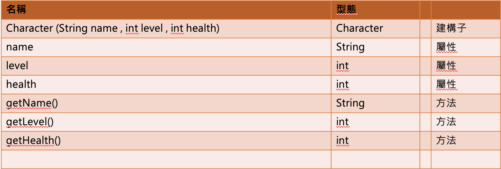
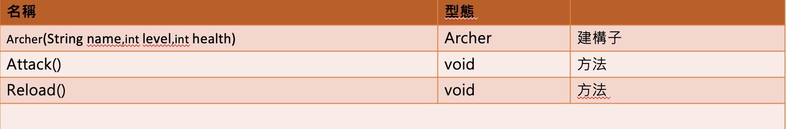
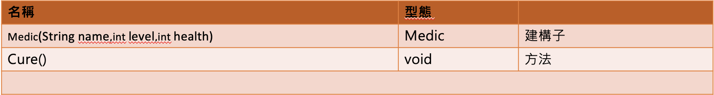

#  第四週作業：
  - 請依照下列的規定，實作出三個class，Character(父)、Archer(子)、Medic(子)
  - Character
    - 
    - Character (String name , int level , int health)為建構子，將name參數存入屬性name；health參數存入屬性health； level參數存入屬性level
    - String getName ()：回傳屬性name
    - Int getLevel()：回傳屬性level
    - Int gethealth()：回傳屬性health
  - Archer
    - 
    - Archer (String name , int level , int health)為建構子，將name參數存入character的屬性name；health參數存入 character的屬性health； level參數存入 character的屬性level
    - void Attack()：印出 “弓箭手 : 發射弓箭”
    - void Reload()：印出   “弓箭手 : 填裝彈藥”
  - Medic
    - 
    - Medic (String name , int level , int health)為建構子，將name參數存入character的屬性name；health參數存入 character的屬性health； level參數存入 character的屬性level
    - void Cure()：印出 “醫護兵 : 治癒中”

